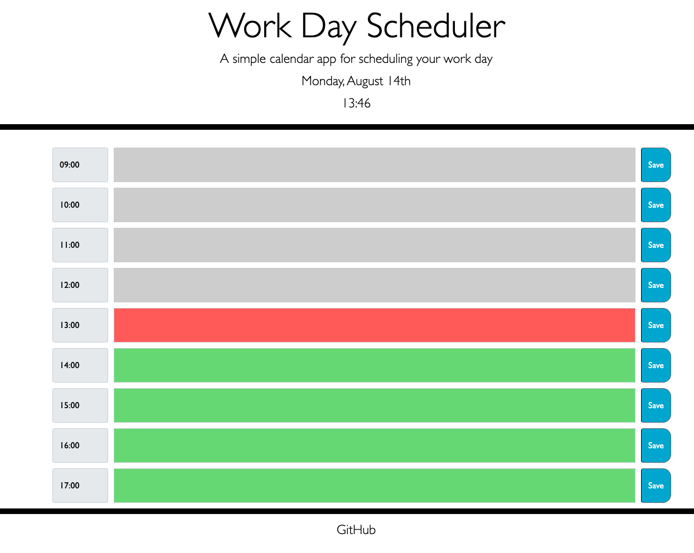

# Work Day Scheduler

## User Story

- 'Andrew' is looking to orgainise his daily work schedule as efficiently as possible.
- He would like to store tasks for every working hour of the day and for these to save in the browser for if he re-opens the site.
- He wants to be able to overwrite changes made as the day progresses, and save individual amandments to each hour.

## Instructions
- The work day scheduler will update the time at the top, allow the user to see the current hour, and the hour(s) coming up.
- Hours that have passed are displayed in grey, the current hour is displayed in red and the remainng hours of the day are displayed in green.
- Users tap on the textarea for the corresponding hour and type their task. Press the 'save' button to store changes.
- Events that the users enter will save in local storage, given users click the corresponding save button.

https://github.com/tobias-firth/work-day-scheduler 

https://tobias-firth.github.io/work-day-scheduler/ 
